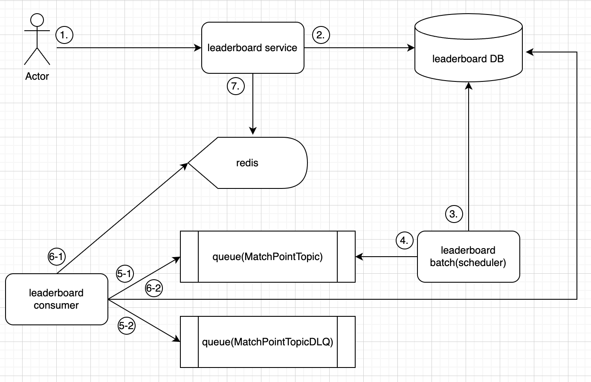
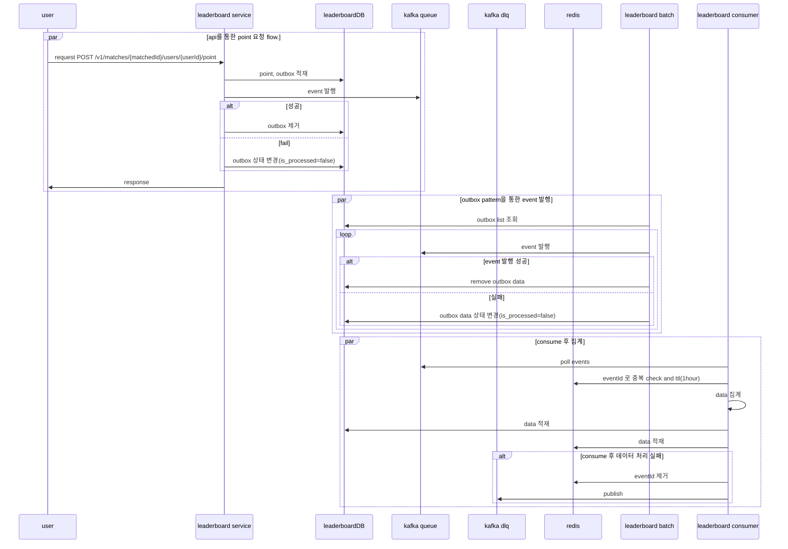
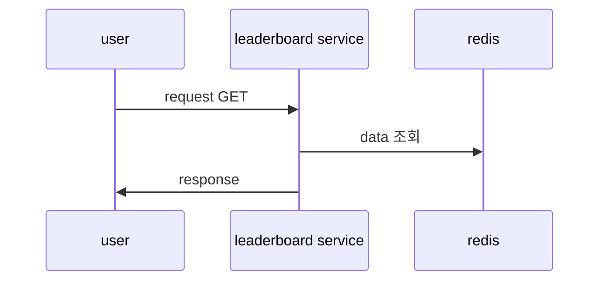

# Leaderboard

## 목표 리스트

- readMe 작성 [완료]
- api 기능 개발 [진행중]
- batch 개발 [완료]
  - outbox
- producer 개발 [완료]
  - eventHandler
- consumer 개발 [완료]
  - 집계 및 적재
- 성능테스트 [미진행]
  - k6로 매트릭 파악

## 요약

- game leaderboard 아키텍처를 작성하고 기능 개발합니다.

## 요구사항

- 게임이 끝나고 player 들의 leaderboard를 구성해야 합니다.
- player가 하루동안 획득한 score를 기반으로 leaderboard를 구성해야 합니다.
- score는 게임에서 획득한 point를 기반으로 합니다.
- leaderboard에는 사용자 id, 점수, 순위가 노출 되어야 합니다.
- 사용자 id로 점수, 순위를 조회할 수 있어야 합니다.
- 게임에 참여한 모든 인원의 순위를 알 수 있어야 합니다.
- daily 순위를 알 수 있어야 합니다.

- 리더보드는 총 2가지를 가집니다.
    - PostMatch Leaderboard -> game 직후 player 들의 leaderboard
    - Daily Leaderboard -> 하루동안 사용자의 leaderboard

## 아키텍처



## 설명

- 사용자의 요청은 leaderboard service 를 통해서만 가능합니다. point 적재, 랭킹 조회를 담당합니다.
- kafka 에 event 발행은 leaderboard batch 를 통해 outbox pattern 을 적용합니다.
- consumer 는 MatchUserPoint 를 집계하여 leaderboardDB, redis 에 적재합니다.
- fail 인 경우 dlq를 통해서 관리합니다.
- cqrs pattern 을 적용해 조회는 1차 집계된 데이터를 통해서 집계합니다.

## 추가 고려사항

- consumer 에서는 중복집계를 어떻게 피할지 고민 합니다.
    - redis에 key를 적재하고 이를 통해서 중복집계를 방지합니다.
    - expired는 ttl을 통해서 관리합니다.
- aggregation 을 어떻게 해야할지 고민이 필요합니다.
    - consumer는 event를 batch로 받아서 aggregation 합니다.
- checkpoint pattern 을 고민해 본다.
    - 이번에는 하지 않습니다.
- outbox 를 대신할 cdc 를 고민한다.
- scheduler 끼리 레이스 컨디션을 고려해야 합니다.(shedlock)
    - shedlock을 이용해 구현할 수 있습니다. 자주 사용했던 부분이라 여기에 적용하지 않습니다.

## 고려하지 않은 사항

- redis zset expired, 데이터 적재 limit는 고려하지 않았습니다.
    - zset을 이용해 조회를 합니다. 데이터 조회는 기획에따라 많이 변경됩니다.
    - 지금은 기획이 없고 스터디를 목적으로 하기에 expired는 고려하지 않습니다.
- 정합성
    - consumer에는 redis 적재도 있습니다. 이는 transaction을 보장하지 않고 있습니다. exception이 발생시 rdb와 redis간 정합성이 깨질 수 있습니다.
    - 재집계 처리가 가능하게 해야 합니다.(rdb의 데이터를 redis에 적재)
    - 재집계 처리시에 고려해야 하는 상황
        - 재집계 처리시에 redis에 leaderboard data는 적재하면 안됩니다.(동시성 이슈 발생가능)

## 시퀀스다이어그램

### point 적재 flow



### ranking 조회 flow



## 사용기술

- library : spring boot, java, jpa, jdbc, redis, kafka
- infra : mysql, redis, kafka

## Domain

## MatchUserPoint

- 사용자 point만 적재합니다.
- matched_id를 기준으로 사용자가 얼마나 포인트를 쌓았는지 확인 합니다.
- index
    - matched_id, user_id
    - user_id

| field      | type   | pk  | Description  | 
|------------|--------|-----|--------------|
| id         | Long   | o   | id           |
| user_id    | String |     | 사용자 id       |
| matched_id | String |     | game 대전 id   |
| point      | Number |     | 획득한 point    |
| pointed_at | Long   |     | point 획득한 시간 |
| matched_at | Long   |     | match 시작 시간  |
| created_at | Long   |     | 생성 시간        |

## MatchUserLeaderboard

- match 된 게임 안에서 랭킹을 조회할 수 있습니다.
- matched_id를 기준으로 사용자가 얼마나 포인트를 쌓았는지 확인 합니다.
- index
    - matched_id, point
    - user_id, matched_id(uk)

| field      | type   | pk  | Description | 
|------------|--------|-----|-------------|
| id         | Number | o   | id          |
| matched_id | String |     | game 대전 id  |
| user_id    | String |     | 사용자 id      |
| point      | Number |     | 획득한 point   |
| updated_at | Long   |     | 수정 시간       |
| created_at | Long   |     | 생성 시간       |

## DailyUserLeaderboard

- 일별로 사용자별 랭킹을 조회할 수 있습니다.
- index
    - date, user_id(uk)
    - date, user_id, point
    - user_id, date

| field      | type     | pk  | Description  | 
|------------|----------|-----|--------------|
| id         | Number   | o   | id           |
| date       | Instant  |     | game 대전 id   |
| user_id    | String   |     | 사용자 id       |
| point      | Number   |     | 획득한 point    |
| created_at | Long     |     | 생성 시간        |
| updated_at | Long     |     | 수정 시간        |

## OutBox

- outbox pattern 을 지원하기 위한 테이블
- index
    - id, isProcessed

| field           | type    | pk  | Description       | 
|-----------------|---------|-----|-------------------|
| id              | Number  | o   | id                |
| event_full_name | String  |     | domain full name  |
| domain_id       | Number  |     | domain id         |
| payload         | json    |     | 데이터               |
| is_processed    | Boolean |     | 진행여부              |
| created_at      | Long    |     | 생성 시간             |

## Main 로직 설명

### EventHandler

#### description

- Outbox 테이블에 데이터를 insert 합니다.
- insert 가 성공하면 kafka event 를 발행 합니다.
- kafka send 결과에 따른 후처리를 whenComplete(callback) 함수로 처리합니다.
  - 성공하면 outbox 데이터 제거, 실패하면 outbox 데이터 상태 변경(isProcessed = false)

### OutboxScheduler

#### description

- event 발행이 실패한 경우 scheduler 를 통해서 event 를 발행합니다.
- event 목록을 조회 후 event 를 발행하고 outbox 테이블에서 제거합니다.
- @Transactional 은 조회와 쓰기에 각각 적용합니다.(transaction 분리)

### PointToLeaderboardConsumer

#### description

- offset 관리는 수동으로 합니다.
- 중복 event 처리 방지를 위해 redis를 통해서 방지
- 1차는 rdb에 적재, 2차는 redis(zset) 적재
- rdb 동시성이슈(insert, update)는 insert duplicate update로 방지
- poll 후에 3의 retry 해도 실패한는 경우 dlq에 적재

## Api

- [POST] /v1/matches/{matchedId}/users/{userId}/point
- [GET] /v1/match-leaderboard/{matchedId}/score
- [GET] /v1/daily-leaderboard/users/{userId}
- [GET] /v1/season-leaderboard/users/{userId}
- [GET] /v1/daily-leaderboard

### [POST] /v1/matches/{matchedId}/users/{userId}/point

#### description

- game match로 획득한 point를 적립한는 api

#### query

- none

#### request body

```json
{
  "point": 4,
  "matchedAt": 123123123123
}
```

#### response

- none

### [GET] /v1/match-leaderboard/{matchedId}/score

#### description

- match 에 참여한 player 들의 랭킹을 조회 합니다.

#### query

- none

#### request body

- none

#### response

```json
{
  "matchedId": "werwfasdfasdf",
  "rankings": [
    {
      "userId": "asdfdsa",
      "point": 1231,
      "ranking": 1
    },
    {
      "userId": "asd44sa",
      "point": 121,
      "ranking": 2
    }
  ]
}
```

### [GET] /v1/daily-leaderboard/users/{userId}

#### description

- 일별 사용자 point 와 ranking 을 조회 합니다.

#### query

- none

#### request body

- none

#### response

```json
{
  "date": "2025-03-22",
  "userId": "asdfdsa",
  "point": 1231,
  "ranking": 1
}
```

### [GET] /v1/daily-leaderboard

#### description

- 일별 랭킹을 조회 합니다.

#### query

- ?date=2025-03-22&size=100&curssor=123

#### request body

- none

#### response

```json
{
  "date": "2025-03-22",
  "rankings": [
    {
      "userId": "asdfdsa",
      "point": 1231,
      "ranking": 1
    },
    {
      "userId": "asd44sa",
      "point": 121,
      "ranking": 2
    }
  ],
  "cursor": "123123"
}
```
